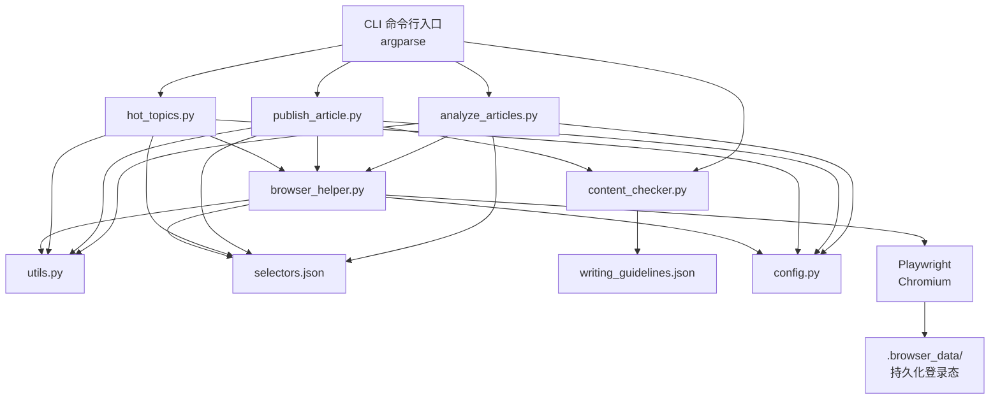

# 小红书自动化工具 — 项目全景文档

> **文档目的**：让接手本项目的 AI（或开发者）快速理解架构、关键设计决策、已知陷阱和优化方向，无需逐文件阅读源码即可有效修改或扩展。

---

## 一、项目概述

本项目是一个基于 **Playwright 浏览器自动化**的小红书（Xiaohongshu / RedNote）内容工具集，提供三大核心能力：

| 能力 | 入口脚本 | 说明 |
|------|----------|------|
| 🔍 学习高流量文章 | `analyze_articles.py` | 搜索关键词 → 抓取笔记列表+详情 → 生成分析报告 |
| 📝 自动发布文章 | `publish_article.py` | 浏览器自动填写标题/正文/标签 → 发布或存草稿，内置质量检查 |
| 🔥 热门话题排行榜 | `hot_topics.py` | 抓取热搜/信息流 → 生成 Top N 排行榜 |
| ✅ 内容质量检查 | `content_checker.py` | 独立检查文章：去 AI 味、事实核验、情绪密度 |

**技术栈**：Python 3.9+ / Playwright / Rich (终端 UI)

---

## 二、目录结构

```
rednote_skill/
├── SKILL.md                          # Skill 入口文档（给 AI agent 读的使用手册）
├── PROJECT_DOC.md                    # ← 本文档
├── .browser_data/                    # Chromium 持久化用户数据（登录态缓存）
├── output/                           # 所有输出文件（JSON、报告）
├── resources/
│   ├── selectors.json                # 🔑 CSS 选择器集中管理
│   └── writing_guidelines.json       # 写作质量规则（去 AI 味等）
├── examples/
│   ├── sample_article.md             # 示例文章
│   └── analysis_report_sample.md     # 示例分析报告
└── scripts/
    ├── requirements.txt              # Python 依赖
    ├── config.py                     # 配置管理（URL、路径、延时参数）
    ├── utils.py                      # 通用工具函数
    ├── browser_helper.py             # 浏览器生命周期 + 登录管理
    ├── analyze_articles.py           # 核心：文章搜索与分析
    ├── publish_article.py            # 自动发布文章
    ├── hot_topics.py                 # 热门话题排行榜
    └── content_checker.py            # 内容质量检查器
```

---

## 三、架构与模块关系



### 依赖层次（从下到上）

1. **config.py** — 零依赖，纯常量定义
2. **utils.py** — 依赖 `config`，提供通用工具
3. **browser_helper.py** — 依赖 `config` + `utils`，管理浏览器生命周期和登录
4. **业务脚本** — 依赖上述三层 + `selectors.json`

---

## 四、各模块详解

### 4.1 `config.py` — 配置管理

集中定义所有硬编码值，修改时只需改这一个文件：

| 配置类别 | 主要常量 | 说明 |
|----------|----------|------|
| 路径 | `PROJECT_ROOT`, `BROWSER_USER_DATA_DIR`, `OUTPUT_DIR` | 项目根目录、浏览器缓存、输出 |
| URL | `XIAOHONGSHU_HOME`, `XIAOHONGSHU_SEARCH`, `XIAOHONGSHU_PUBLISH` | 小红书各页面地址 |
| 延时 | `PAGE_LOAD_WAIT=(2,4)`, `ACTION_DELAY=(1,3)`, `SCRAPE_DELAY=(2,4)` | (min, max) 秒，随机取值防检测 |
| 浏览器 | `VIEWPORT_WIDTH=1280`, `USER_AGENT` | 视口和 UA |
| 抓取 | `DEFAULT_ARTICLE_COUNT=20`, `MAX_ARTICLE_COUNT=100` | 限制 |

### 4.2 `utils.py` — 通用工具函数

| 函数 | 用途 | 关键注意 |
|------|------|----------|
| `random_delay(min, max)` | 随机等待，防反爬 | 所有操作间隙都要调用 |
| `human_type(page, sel, text)` | 逐字输入模拟人工 | 发布脚本使用 |
| `safe_click(page, sel)` | 带重试的安全点击 | 3次重试 |
| `extract_text(element)` | 安全提取文本 | 元素为 None 时返回默认值 |
| `parse_count(text)` | 解析 "1.2万"→12000 | 支持万/千/亿/w/k |
| `wait_for_any_selector(page, [...])` | 等待任一选择器出现 | 先 combined，再逐个 fallback |
| `smooth_scroll(page)` | 模拟人工滚动 | 用于加载更多结果 |

### 4.3 `browser_helper.py` — 浏览器 + 登录管理

**核心职责**：
- `launch_browser()` → 启动 Chromium 持久化 Context（复用登录态），返回 `(context, page)`
- `close_browser(context)` → 安全关闭
- `ensure_login(page)` → 统一登录入口，导航到首页检测登录
- `ensure_login_on_page(page)` → 在当前页面检测登录弹窗

**登录检测策略**（重要设计决策）：
```
反向检测优先：
  1. _has_login_popup() — 检测登录弹窗（最可靠的"未登录"信号）
  2. 如果有弹窗 → 一定没登录 → 等待用户扫码
正向检测：
  3. Cookie 中存在 auth token（web_session、a1 等）→ 已登录
```

> [!WARNING]
> **Playwright click vs JS click**：某些小红书元素（如 `div.filter`）对 Playwright 的 `.click()` 方法无响应，但 `page.evaluate("el.click()")` 有效。这是因为 Playwright 会计算元素中心点坐标并模拟鼠标事件，而有些元素被 overlay 遮挡或 Vue 事件代理不响应合成事件。遇到点击无效时，优先尝试 JS click。

### 4.4 `analyze_articles.py` — 核心抓取分析

**主流程**（`analyze()` 函数）：
```
1. launch_browser → ensure_login
2. search_keyword(keyword, sort)
   ├── 导航到搜索 URL
   ├── ensure_login_on_page (搜索页可能弹登录)
   └── _apply_filters(sort)
       ├── JS click "div.filter" 打开筛选面板
       ├── 等待 "div.filter-panel" 出现
       └── 在面板中按文本点击排序选项 + 日期选项
3. scrape_note_list(count)
   ├── 查找 section.note-item 元素
   ├── 提取: title(a.title), url(a[href]), like_count(.like-wrapper .count)
   └── 滚动加载更多 (smooth_scroll)
4. FOR EACH note:
   ├── 打印笔记 URL
   ├── 在搜索结果中重新定位 note_element（按 URL 匹配）
   ├── scrape_note_detail_via_popup(note_element)
   │   ├── 点击 a.cover → 弹窗打开
   │   ├── 等待弹窗 (.note-detail-mask / #noteContainer)
   │   ├── 提取: title, content, like/collect/comment, tags, time, author
   │   └── 返回 detail_data
   ├── 合并 detail_data 到 note dict
   └── _close_detail_popup() → Escape / div.close-box
5. save_to_json → generate_analysis_report → _print_summary
```

**关键"坑"记录**：

| 问题 | 原因 | 解决方案 |
|------|------|----------|
| 筛选面板不打开 | Playwright `.click()` 对 `div.filter` 无效 | 改用 `page.evaluate("...click()")` |
| 弹窗标题全一样 | `.title` 选择器匹配到背景页卡片标题 | 限定选择器为 `#detail-title` / `.note-scroller .title` |
| 弹窗互动数据全一样 | `.like-wrapper .count` 匹配到背景页 | 改为 `.interact-container .like-wrapper .count` |
| 弹窗关闭后搜索结果丢失 | `page.go_back()` 破坏 SPA 状态 | 改用 `Escape` 键关闭弹窗 |
| 视频笔记无标题元素 | 视频卡片没有 `a.title` | fallback 到 `a, span` |
| 笔记重新定位失败 | 弹窗关闭后 DOM 变化 | 根据 `href` 属性重新匹配 `section.note-item` |

### 4.5 `selectors.json` — CSS 选择器集中管理

> [!IMPORTANT]
> **这是整个项目最关键的维护点**。小红书频繁改版，选择器会失效。修改选择器只需改此文件，不需要改 Python 代码。

结构分为 5 个模块：

```json
{
  "login":       { /* 登录弹窗、二维码、头像、关闭按钮 */ },
  "search":      { /* 搜索输入、筛选、笔记列表、笔记标题、点赞数 */ },
  "note_detail": { /* 弹窗容器、标题、正文、互动数据、标签、作者 */ },
  "explore":     { /* 探索页话题卡片 */ },
  "trending":    { /* 热搜榜 */ },
  "publish":     { /* 发布页标题/正文输入、标签、封面、发布按钮 */ }
}
```

> [!CAUTION]
> **选择器优先级规则**：越具体的选择器放在前面（逗号分隔），越泛的放后面。但**绝不能用裸选择器**（如 `.title`、`.count`）作为 fallback，因为它们会匹配到弹窗背后的搜索结果页元素。所有 `note_detail` 选择器必须限定在弹窗容器内（`#detail-title`、`.interact-container .xxx`、`#noteContainer .xxx`）。

### 4.6 `publish_article.py` — 自动发布

流程：
```
1. 内容质量检查（除非 --skip-check）
   └── check_content() → 评分 ≥ 60 通过
2. launch_browser → ensure_login
3. 导航到创作者中心发布页
4. fill_title → fill_content → add_tags → upload_cover
5. click_publish_or_draft
```

### 4.7 `hot_topics.py` — 热门话题

三级降级策略：
```
1. 搜索热搜 (scrape_trending_from_search) — 搜索框热搜榜
2. 探索页推荐 (scrape_explore_topics) — 固定话题卡片
3. 信息流分析 (scrape_trending_from_feed) — 统计高频标签
```

### 4.8 `content_checker.py` — 内容质量检查

基于 `writing_guidelines.json` 的规则引擎：

| 检查项 | 函数 | 说明 |
|--------|------|------|
| AI 感词句 | `check_ai_patterns()` | 检测 forbidden_patterns 列表中的词句 |
| 事实捏造 | `check_fabrication_risk()` | 正则识别时间/价格/地点等具体事实 |
| 情绪密度 | `check_emotion_density()` | 连续 3+ 感叹句标记过密 |
| 内容长度 | `check_content_length()` | 150-800 字 |
| 标题质量 | `check_title_quality()` | 长度、Emoji、避免违规词 |

返回 `ContentCheckResult` 对象：`score` (0-100)、`warnings`、`errors`、`suggestions`。

---

## 五、环境配置与运行

### 5.1 安装依赖

```bash
pip install -r scripts/requirements.txt
python -m playwright install chromium
```

**依赖清单**：
- `playwright>=1.40.0` — 浏览器自动化
- `beautifulsoup4>=4.12.0` — HTML 解析（hot_topics 使用）
- `rich>=13.0.0` — 终端 UI（表格、进度条、面板）
- `pydantic>=2.0.0` — 数据验证（目前仅间接使用）

### 5.2 首次登录

```bash
cd scripts
python browser_helper.py
# 浏览器会打开小红书首页 → 手动扫码登录 → 脚本自动检测登录成功
# 登录态缓存在 .browser_data/ 目录，后续无需重新登录
```

### 5.3 常用命令

```bash
# 分析热门文章（按点赞排序，半年内）
python scripts/analyze_articles.py --keyword "美食推荐" --count 20 --sort hot

# 热门话题排行榜
python scripts/hot_topics.py --count 20

# 发布文章（仅存草稿）
python scripts/publish_article.py --title "标题" --content-file article.md --tags "标签1,标签2" --draft

# 独立内容检查
python scripts/content_checker.py --title "标题" --content "正文"
```

---

## 六、关键设计决策与技术债

### 6.1 设计决策

| 决策 | 理由 |
|------|------|
| 使用 Playwright 而非 API | 小红书没有公开 API，所有操作必须模拟浏览器 |
| 持久化 BrowserContext | 复用登录态，避免每次扫码。缓存在 `.browser_data/` |
| 选择器外部化到 JSON | 小红书前端频繁改版，分离选择器可以不改代码只改 JSON |
| 反向检测登录状态 | 正向检测（检查头像/链接）不可靠，登录弹窗是最确定的"未登录"信号 |
| 随机延时 + 人工模拟 | 所有操作间插入 `random_delay`，逐字输入模拟人工，降低反爬风险 |
| SPA 弹窗抓取 | 小红书搜索页是 SPA，点击笔记不跳转而是弹窗，用 Escape 关闭保持 DOM |

### 6.2 已知技术债

1. **没有单元测试** — 所有验证依赖 E2E 运行，改动后需全流程测试
2. **选择器硬编码在 JSON 中** — 虽然比写死在代码里好，但仍需人工维护
3. **没有代理/IP 轮换** — 长时间大量抓取可能被封，目前仅靠延时缓解
4. **报告生成逻辑** — `generate_analysis_report()` 有 130+ 行，关键词提取用简单切片而非 NLP
5. **错误重试不完善** — 弹窗打开失败时会跳过笔记但不会重试

---

## 七、优化方向建议

### 高优先级

| 方向 | 具体建议 |
|------|----------|
| **选择器自愈** | 当选择器匹配失败时，用 AI 动态分析页面 DOM 找到替代选择器，减少人工维护 |
| **并发抓取** | 当前逐个点击笔记弹窗是串行的，可以用多 Tab/多 Context 并发 |
| **增量抓取** | 记录已抓取的笔记 URL，下次可以增量更新而不是全量重抓 |
| **NLP 关键词提取** | 替换 `content[:4]` 的简单切片，使用 jieba 分词或 TF-IDF 提取关键词 |
| **重试机制** | 弹窗打开失败、网络超时等场景增加指数退避重试 |

### 中优先级

| 方向 | 具体建议 |
|------|----------|
| **数据持久化** | 用 SQLite 替代纯 JSON，支持查询和去重 |
| **代理支持** | 集成代理池，轮换 IP 防封 |
| **定时任务** | 结合操作系统计划任务或 APScheduler，定期抓取和分析 |
| **API 化** | 将核心功能封装成 FastAPI 服务，前端调用 |
| **配置扩展** | 支持从环境变量或 YAML 加载配置，便于不同环境部署 |

### 低优先级

| 方向 | 具体建议 |
|------|----------|
| **多平台** | 扩展到抖音、B站等平台，复用架构但换选择器 |
| **数据可视化** | 报告中增加图表（用 matplotlib 或 Echarts） |
| **AI 生成文章** | 结合 LLM 根据分析结果自动生成符合规范的文章 |

---

## 八、修改指南

### 8.1 小红书改版后修复选择器

1. 打开 `resources/selectors.json`
2. 用浏览器 DevTools（F12）检查对应页面的真实 DOM
3. 更新 JSON 中的选择器值
4. 运行 `python analyze_articles.py --keyword "测试" --count 1` 验证

> [!TIP]
> 可以写一个临时 debug 脚本来检查 DOM：
> ```python
> result = await page.evaluate("""
>     () => {
>         const el = document.querySelector('你的选择器');
>         return el ? { text: el.innerText, tag: el.tagName } : null;
>     }
> """)
> ```

### 8.2 添加新的抓取字段

1. 在 `selectors.json` 的 `note_detail` 中添加新选择器
2. 在 `analyze_articles.py` 的 `scrape_note_detail_via_popup()` 中添加提取逻辑
3. 在 `generate_analysis_report()` 中使用新字段

### 8.3 添加新的排序/筛选选项

修改 `_apply_filters()` 函数中的 `sort_map` 字典和 `date_text` 变量。筛选面板的交互逻辑：
```python
# 1. JS click 打开面板
await page.evaluate("document.querySelector('div.filter').click()")
# 2. 等待面板
await page.wait_for_selector("div.filter-panel", timeout=3000)
# 3. 在面板中按文本匹配点击
await page.evaluate("({ sortText }) => { ... }", {"sortText": "最多收藏"})
```

### 8.4 修改内容质量规则

编辑 `resources/writing_guidelines.json`：
- `forbidden_patterns` → AI 感词句黑名单
- `emotion_techniques` → 推荐写法
- `title_rules` → 标题规则
- `content_check_rules` → 检查规则定义

对应 Python 检查逻辑在 `content_checker.py`。

---

## 九、调试技巧

### 9.1 Playwright 检查器

```bash
# 带 GUI 启动 Playwright 调试器
PWDEBUG=1 python scripts/analyze_articles.py --keyword "test" --count 1
```

### 9.2 临时 Debug 脚本模板

```python
import asyncio, sys
from pathlib import Path
sys.path.insert(0, str(Path(__file__).parent / "scripts"))

import config
from browser_helper import launch_browser, close_browser, ensure_login
from utils import random_delay

async def debug():
    context, page = await launch_browser()
    try:
        await ensure_login(page)
        # 导航
        await page.goto("https://www.xiaohongshu.com/search_result?keyword=测试&type=51")
        await random_delay(3, 4)
        
        # 检查 DOM
        result = await page.evaluate("""
            () => {
                const elements = document.querySelectorAll('你的选择器');
                return Array.from(elements).map(el => ({
                    tag: el.tagName,
                    class: el.className,
                    text: el.innerText?.substring(0, 100)
                }));
            }
        """)
        print(result)
    finally:
        await close_browser(context)

asyncio.run(debug())
```

### 9.3 常见问题排查

| 症状 | 可能原因 | 排查方法 |
|------|----------|----------|
| "筛选面板未打开" | Playwright click 无效 | 改用 JS click |
| 所有笔记标题/数据一样 | 选择器匹配到背景页而非弹窗 | 检查 selectors.json 中是否有裸 `.title` |
| 登录检测误报"已登录" | Cookie 残留但实际过期 | 清除 `.browser_data/` 重新登录 |
| 弹窗关闭后搜索结果消失 | 使用了 `page.go_back()` | 改用 Escape 键关闭 |
| 笔记卡片点击无反应 | 元素被遮挡或不可交互 | 尝试 `a.cover` 作为点击目标 |
| 长时间抓取后被限流 | 没有足够的随机延时 | 增大 `SCRAPE_DELAY` |

---

## 十、数据格式参考

### 10.1 抓取的笔记 JSON 结构

```json
{
  "title": "笔记标题",
  "url": "/explore/68ad7aee...",
  "detail_url": "https://www.xiaohongshu.com/explore/68ad7aee...?xsec_token=...",
  "like_count": 31000,
  "collect_count": 13000,
  "comment_count": 1414,
  "content": "笔记正文...",
  "tags": ["#标签1", "#标签2"],
  "publish_time": "编辑于 2025-11-23",
  "author": "作者名",
  "detail_status": "ok",
  "scraped_at": "2026-02-12T11:23:42.858092"
}
```

### 10.2 分析报告包含的模块

1. **互动数据 Top 10** — 按点赞排序
2. **高频关键词 Top 20** — 从标题+内容中提取
3. **标题模式分析** — 平均长度、疑问句比例、含数字/Emoji 比例
4. **标签使用策略** — 高频标签排行
5. **内容长度与互动率关系** — 短/中/长分组统计
6. **创作建议** — 自动生成的优化建议
